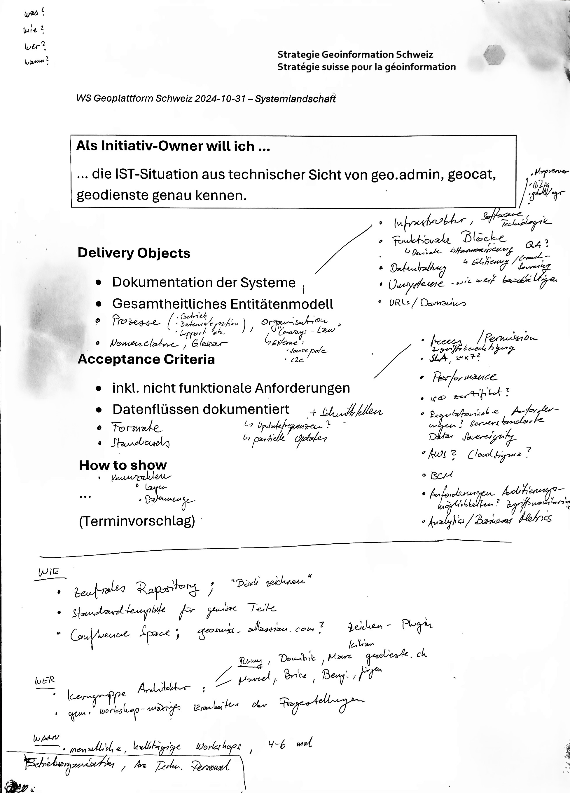
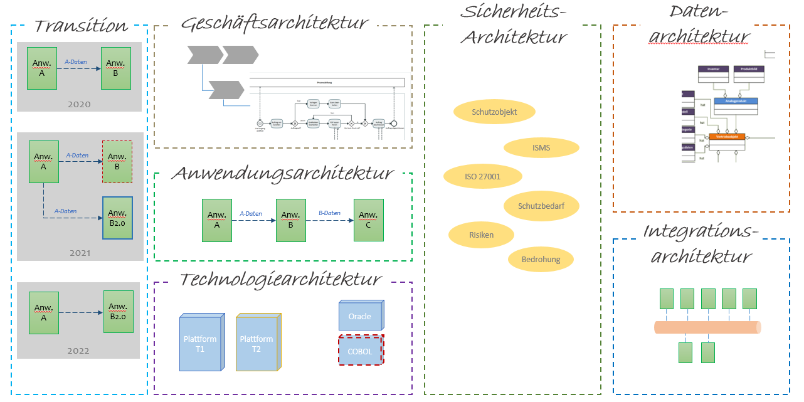
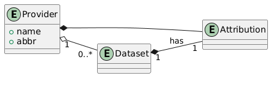
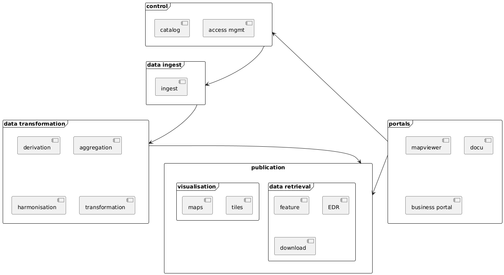
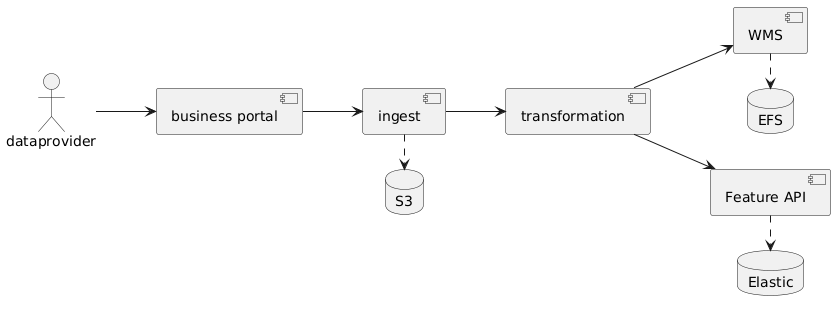

# Workshop Münster

Folgende Initiativen sind definiert

- **IST-Situation Architektur**: Bestandesaufnahme des Bestehenden in sämtlichen Architekturaspekten.
- **Zielbild Architetur**: Sicht der Gesamtarchitektur, die den angestrebten Zustand am Ende eines bestimmten Zeitraums beschreibt, einschließlich der in diesem Zeitraum erforderlichen Systemänderungen.

# IST-Situation Architektur

Architektur beinhaltet eine Vielzahl von Themen welche über rein technische Aspekte hinausgehen.

- Geschäftsarchitektur
- Informationsarchitektur
- Informationssystemarchitektur
- Technologie- & Plattformarchitektur

---
> **DEFINITION**
> 
> Unter Informationsarchitektur werden alle Aspekte im Zusammenhang mit der Struktur und dem Fluss von Informationen (Daten) betrachtet: Datenmodelle, konzeptionelle Datenmodelle, Datenstrukturen, Datenkataloge, Datenflüsse. 
> - Datenkatalog
> - Konzeptionelles Datenmodelle
> - Datenfluss Diagramme
---

Lieferobjekte von Architekturanalysen bezeichnen wir als "Architekturartefakte", wie z.B.:

- Architektursichten
- IST- und/oder Zielbilder
- Analysen
- Datenmodelle
- Prozessbeschreibungen
- Anwendungskontextdiagramme
- technische  Architekturen
- ...

Die Architektur wird mit Hilfe von Architecture Building Blocks (ABB) beschrieben. Ein ABB ist eine Komponente des Architekturmodells, die einen einzelnen Aspekt des Gesamtmodells beschreibt und lösungsneutral ist.
Ein ABB kann sowohl für die Bereitstellung/Beschreibung von geschäftsorientierten und technisch orientierten Diensten (d.h. in der Anwendungs- und Technologiearchitektur). ABB´s können auf verschiedenen Detaillierungsstufen beschrieben werden; in der Systemarchitektur werden 2 Detaillierungsstufen beschrieben.

Das Ziel dieser Initiative ist es, eine Bestandesaufnahme der bestehenden Teile über die folgenden Themenbereiche zu machen:

- [Glossar](#glossar)
- [Datenarchitektur: Entitätenmodell](#datenarchitektur-entitätenmodell)
- [Systemarchitekur](#systemarchitekur)
- [Datenarchitektur: Datenflüsse \& Datenhaltung](#datenarchitektur-datenflüsse--datenhaltung)
- [Prozesse \& Organisation](#prozesse--organisation)
- [Technologie \& Plattformarchitektur](#technologie--plattformarchitektur)
- [Non-functional Requirements](#non-functional-requirements)
- [Formats/Standards](#formatsstandards)

## Glossar

Sämtliche verwendeten Begrifflichkeiten sollen inklusive Definition gesammelt werden. Dieses Glossar soll in einem nächsten Schritt über alle Systeme harmonisiert werden und Duplikate (oder fast Duplikate) eliminiert werden.

**Deliverable:**

Tabelle mit Begriffen, Quellen und jeweiliger Definition.

Bsp:

| Begriff | Quelle | Definition |
| ---- | ---- | ---- |
| Geodatenderivaten | PPBGDI/Geodienste | Ein Datenderivat ("aus andere Daten generierte Datensätze") ist eine (automatisiert generierbare) Verknüpfung zwischen verschiedene Geodatensätze, ohne Änderungen der Originaldaten. |
| Publikationsplattform | PPBGDI | Die BGDI Publikationsplattform ist ein Informationssystem bestehend aus Anwendungen, Services, Software- und Plattformkomponenten inkl. der dazugehörigen Schnittstellen mit dem Zweck der Publikation von Geodaten. |
| Historisierung | ... | ... |
| Versionierung | ... | ... |

Inspiration: see [Terminologie & Abkürzungen](https://ltwiki.adr.admin.ch:8443/pages/viewpage.action?pageId=208764945)

## Datenarchitektur: Entitätenmodell

Das Entity Model stellt sämtliche Datenentitäten welche sich aus konzeptioneller Betrachtung der Systeme ergeben inklusive ihrer Abhängigkeiten dar. Ein vereinheitlichtes Entitätenmodell ist eine ganz zentrale Voraussetzung für eine Konvergation der Teilsysteme hin zu einer Plattform.

---
> Als **Entität** (auch Informationsobjekt genannt) wird in der Datenmodellierung ein eindeutig zu bestimmendes Objekt bezeichnet, über das Informationen gespeichert oder verarbeitet werden sollen. Das Objekt kann materiell oder immateriell, konkret oder abstrakt sein. 
---

Bsp:

**Deliverable**:

- graphisches Entitätenmodell; Identifizierung von Gemeinsamkeiten und Abweichungen/Inkompatibilitäten
- Liste mit grundlegenden Fragen und gegebenenfalls bereits Antworten vom Business welche beantwortet werden müssen um weitergehen zu können (sollen nach Möglichkeit laufen adressiert werden)
- evtl. Draft von einem Ziel-Entitätenmodell

## Systemarchitekur

Die Systemarchitektur ist eine Beschreibung der logischen, fachlichen und technischen Struktur aller einem Informationssystem zugehörenden Komponenten (die Architektur eines Informationssystems). Ebenso sollen wichtige Umsysteme und externe Abhängigkeiten sichtbar gemacht werden.

**Deliverable**

Graphische Übersicht in welcher sämtliche Informationssysteme resp. funktionalen Komponenten in verschiedenen Detaillierungsstufen inklusive Abhängigkeiten dargestellt sind. Für jedes Informationssystem existiert ein FactSheet sowie ein Kontextdiagramm.

Bsp:

> **Informationssytem**
>
> Ein Informationssystem bezeichnet die Einheit aller zu einer Geschäftsanwendung (Business Application) gehörenden Komponenten (Anwendungen, Services, Software-Module, Datenhaltungskomponenten, etc.). Kann auch eine Gruppe von separaten Anwendungen sein, die einem gemeinsamen, fachlichen Zweck dienen (z.B. Collaboration-Tools).
>
> Ein Informationssystem hat i.d.R. einheitliche, definierte Entwicklungs- (koordinierte Releases) und Lebenszyklen (Inbetriebnahme, Ablösung).

## Datenarchitektur: Datenflüsse & Datenhaltung

Die Datenflüsse und Datenhaltung für sämtliche Datenentitäten soll aufgezeichnet werden.

Bsp:

**Deliverable**:

- Graphische Diagramme welche die Datenflüsse der zentralen Entitäten abbilden.

## Prozesse & Organisation

- Geschäftsprozesse
- Anfrage
- Betriebsprozesse
  - Support
  - Incident
- Entwicklungsprozess

## Technologie & Plattformarchitektur

Welche Technologien werden eingesetzt?

- Software
- Technologie
  - AWS
  - on-prem Cloudsigma

## Non-functional Requirements

- Welche Anforderungen ergeben sich aus regulatorischer oder gesetzlicher Sicht betreffend Datenzugriff und -schutz.
- Berechtigungsmanagement
- SLA/SLO
- ISO?
- BCM

## Formats/Standards

Welche Formate werden verwendet? Welche Standards existieren, welche davon sind relevant oder bindend?

# Zielbild Architektur

T.b.d

# Transition 1

